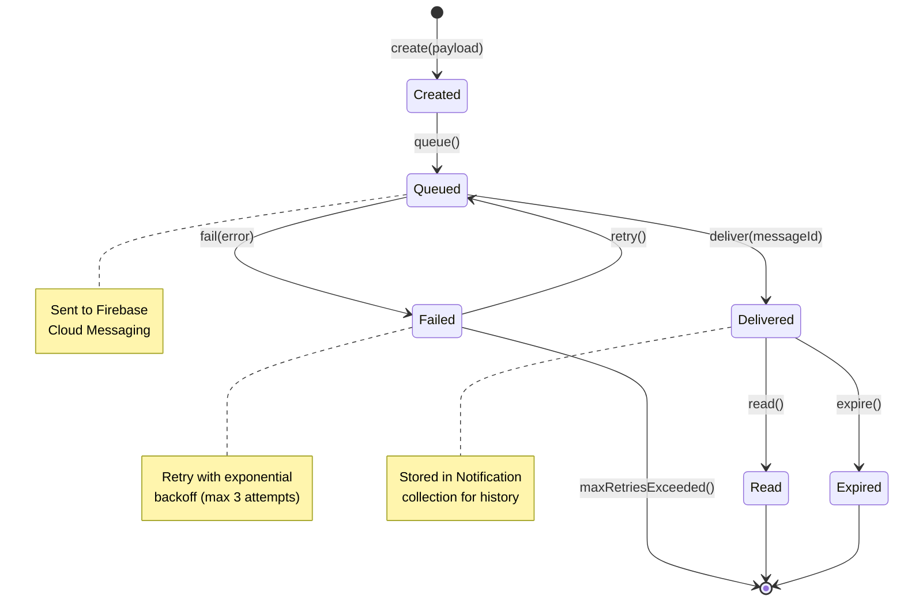

# SM6: Notification State Machine

**State Machine ID:** SM6  
**Entity Name:** Notification  
**Version:** 1.0  
**Date:** 2025-12-29

---

## 1. Purpose

This state machine diagram models the lifecycle of a Notification from creation to user acknowledgment. It tracks delivery status and user interaction, essential for ensuring reliable communication and analytics.

---

## 2. States & Transitions

| State         | Description                                               |
| ------------- | --------------------------------------------------------- |
| **Created**   | Notification has been generated by the system.            |
| **Queued**    | Notification is queued for delivery via FCM.              |
| **Delivered** | FCM has successfully delivered to device.                 |
| **Failed**    | Delivery failed (invalid token, network issue).           |
| **Read**      | User has acknowledged/opened the notification.            |
| **Expired**   | Notification expired without being read (time-sensitive). |

| Transition | From State | To State  | Trigger Event                 |
| ---------- | ---------- | --------- | ----------------------------- |
| create     | [Initial]  | Created   | System generates notification |
| queue      | Created    | Queued    | Notification sent to FCM      |
| deliver    | Queued     | Delivered | FCM confirms delivery         |
| fail       | Queued     | Failed    | FCM returns error             |
| retry      | Failed     | Queued    | Retry logic triggered         |
| read       | Delivered  | Read      | User taps/opens notification  |
| expire     | Delivered  | Expired   | TTL exceeded without read     |

---

## 3. Mermaid Diagram

---

## 4. Actors / Components

| Actor / Component    | Role in State Transitions                          |
| -------------------- | -------------------------------------------------- |
| **Backend Services** | Triggers `create`, `queue`, `retry`                |
| **Firebase FCM**     | Triggers `deliver`, `fail`                         |
| **Mobile App**       | Triggers `read` when user interacts                |
| **TTL Timer**        | Triggers `expire` for time-sensitive notifications |

---

## 5. Notes / Considerations

- **Database Model:** `Notification` collection with `isRead` field and `timestamp`.
- **Retry Logic:** Failed notifications are retried up to 3 times with exponential backoff.
- **Analytics:** Tracking read vs. expired rates helps optimize notification content and timing.
- **TTL (Time-To-Live):** Critical notifications (bus arriving) have short TTL; general announcements have longer TTL.
