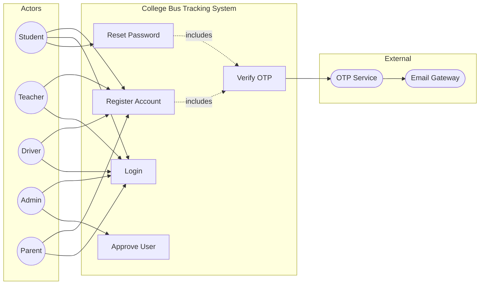

# UC1: User Authentication

**Use Case ID:** UC1  
**Use Case Name:** User Authentication  
**Version:** 1.0  
**Date:** 2025-12-29

---

## 1. Purpose

This use case describes the process by which users (Students, Teachers, Drivers, Admins) authenticate themselves to access the College Bus Tracking System. It includes registration for new users, login for existing users, and password recovery via OTP.

---

## 2. Use Case Diagram

---

## 3. Actors

| Actor                  | Type      | Description                                                                       |
| ---------------------- | --------- | --------------------------------------------------------------------------------- |
| User                   | Primary   | Any individual (Student, Teacher, Driver, Admin) attempting to access the system. |
| Authentication Service | Secondary | Backend module responsible for credential verification and token generation.      |
| OTP Service            | Secondary | System component responsible for generating and validating One-Time Passwords.    |
| Email/SMS Gateway      | External  | Third-party service for delivering OTP to users.                                  |

---

## 3. Preconditions

1. The mobile application is installed and has network connectivity.
2. The backend server is operational and accessible.
3. For registration: The user's email domain must be in the college's allowed domain list (if email-based verification is enabled).
4. For login: The user must have a previously registered and approved account.

---

## 4. Main Flow

| Step | Actor                  | Action                                                                                                   |
| ---- | ---------------------- | -------------------------------------------------------------------------------------------------------- |
| 1    | User                   | Opens the mobile application and selects "Login" or "Register".                                          |
| 2    | System                 | Displays the appropriate form (Login: Email/Phone + Password; Register: Full details).                   |
| 3    | User                   | Enters credentials and submits the form.                                                                 |
| 4    | System                 | Sends an HTTP POST request to `/api/auth/login` or `/api/auth/register`.                                 |
| 5    | Authentication Service | Validates credentials against the `User` collection in MongoDB.                                          |
| 6    | Authentication Service | If valid, generates a JWT access token.                                                                  |
| 7    | System                 | Returns the token to the mobile application.                                                             |
| 8    | Mobile App             | Stores the token securely (e.g., `flutter_secure_storage`) and navigates to the role-specific dashboard. |

---

## 5. Alternative Flows / Exceptions

### AF1: Invalid Credentials

| Step | Action                                                              |
| ---- | ------------------------------------------------------------------- |
| 5a   | Authentication Service finds no matching user or password mismatch. |
| 5b   | System returns an error response (HTTP 401).                        |
| 5c   | Mobile App displays "Invalid email or password" message.            |

### AF2: Account Not Approved

| Step | Action                                                        |
| ---- | ------------------------------------------------------------- |
| 5a   | User account exists but `approved` flag is `false`.           |
| 5b   | System returns an error indicating pending approval.          |
| 5c   | Mobile App displays "Your account is pending admin approval." |

### AF3: Password Reset via OTP

| Step | Action                                              |
| ---- | --------------------------------------------------- |
| 1    | User selects "Forgot Password".                     |
| 2    | User enters registered email/phone.                 |
| 3    | System calls OTP Service to generate a 6-digit OTP. |
| 4    | OTP Service sends OTP via Email/SMS Gateway.        |
| 5    | User enters OTP in the app.                         |
| 6    | System validates OTP and allows password reset.     |

---

## 6. Modules / Components Represented

| Component                | Role in Use Case                                                                                                 |
| ------------------------ | ---------------------------------------------------------------------------------------------------------------- |
| **Mobile App (Flutter)** | `lib/screens/auth/` - UI for login, register, OTP screens. `lib/services/auth_service.dart` - API communication. |
| **Backend (Node.js)**    | `src/controllers/authController.ts` - Business logic. `src/routes/authRoutes.ts` - Endpoint definitions.         |
| **Database (MongoDB)**   | `User` collection - Stores credentials, role, approval status.                                                   |
| **Security**             | JWT for session management. Bcrypt for password hashing.                                                         |

---

## 7. Notes

- **Real-time Interaction:** None for this use case.
- **Security Consideration:** Passwords are hashed using `bcrypt` before storage. JWTs have a defined expiry and should be refreshed periodically.
- **Academic Detail:** This use case implements the "Authentication" and "Authorization" security patterns, ensuring that only verified users with approved roles can access system resources.
