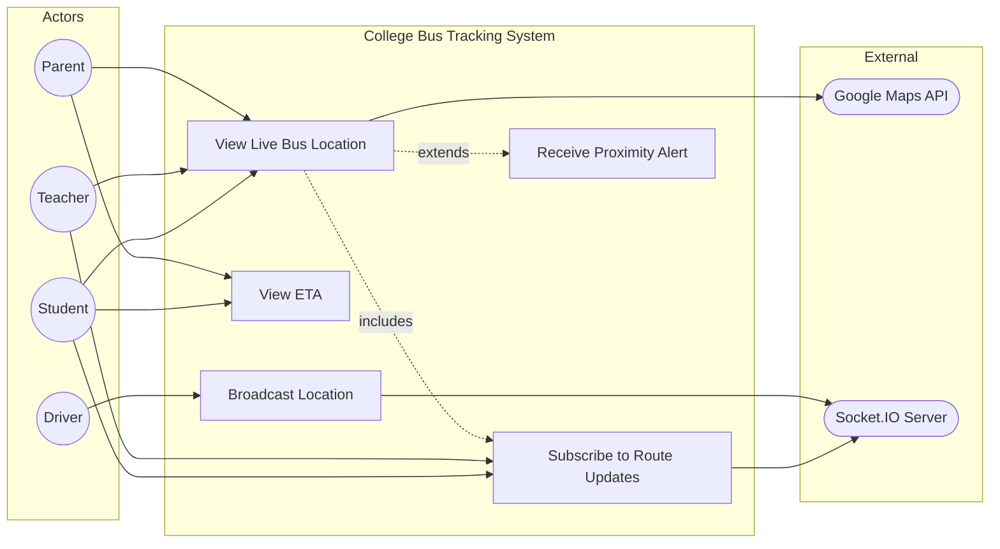

# UC2: View Live Bus Location

**Use Case ID:** UC2  
**Use Case Name:** View Live Bus Location  
**Version:** 1.0  
**Date:** 2025-12-29

---

## 1. Purpose

This use case describes how Students and Teachers can view the real-time location of buses on an interactive map. This is the core functionality of the tracking system, enabling users to plan their commute based on live bus positions and estimated arrival times.

---

## 2. Use Case Diagram

---

## 3. Actors

| Actor             | Type      | Description                                                        |
| ----------------- | --------- | ------------------------------------------------------------------ |
| Student / Teacher | Primary   | End-users who wish to track their assigned bus.                    |
| Driver            | Secondary | Provides location updates by running the Driver App during a trip. |
| Socket.IO Server  | Secondary | Real-time communication layer for broadcasting location updates.   |
| Google Maps API   | External  | Provides map rendering and geocoding services.                     |

---

## 3. Preconditions

1. The user is authenticated and has an active session.
2. The user is assigned to a specific route (`routeId` is set in their profile).
3. At least one bus on the user's route has an active trip (Driver has started the trip).
4. The mobile device has location permissions granted and network connectivity.

---

## 4. Main Flow

| Step | Actor               | Action                                                                               |
| ---- | ------------------- | ------------------------------------------------------------------------------------ |
| 1    | Student/Teacher     | Opens the mobile application and navigates to the Dashboard/Map screen.              |
| 2    | Mobile App          | Establishes a WebSocket connection to the backend via Socket.IO.                     |
| 3    | Mobile App          | Emits a `joinRoom` event with the user's `routeId` to subscribe to relevant updates. |
| 4    | Socket.IO Server    | Adds the client to the specified room.                                               |
| 5    | Driver (concurrent) | The Driver App continuously emits `updateLocation` events with GPS coordinates.      |
| 6    | Socket.IO Server    | Broadcasts `busLocationUpdate` event to all clients in the route's room.             |
| 7    | Mobile App          | Receives the location payload `{ busId, lat, lng, speed, heading }`.                 |
| 8    | Mobile App          | Updates the bus marker position on the Google Map in real-time.                      |
| 9    | User                | Views the bus moving on the map and can see ETA to their stop.                       |

---

## 5. Alternative Flows / Exceptions

### AF1: No Active Buses

| Step | Action                                                     |
| ---- | ---------------------------------------------------------- |
| 4a   | No driver has started a trip on the user's assigned route. |
| 4b   | Mobile App displays "No active buses on your route."       |

### AF2: WebSocket Connection Failure

| Step | Action                                                                   |
| ---- | ------------------------------------------------------------------------ |
| 2a   | Socket.IO connection fails (network issue, server down).                 |
| 2b   | Mobile App displays "Unable to connect to tracking service. Retrying..." |
| 2c   | `SocketService` implements exponential backoff retry logic.              |

### AF3: User Not Assigned to a Route

| Step | Action                                                              |
| ---- | ------------------------------------------------------------------- |
| 3a   | User's `routeId` is null or undefined.                              |
| 3b   | Mobile App displays "Please select your route in Profile settings." |

---

## 6. Modules / Components Represented

| Component                | Role in Use Case                                                                                              |
| ------------------------ | ------------------------------------------------------------------------------------------------------------- |
| **Mobile App (Flutter)** | `lib/screens/student/student_dashboard.dart` - Map UI. `lib/services/socket_service.dart` - WebSocket client. |
| **Backend (Node.js)**    | `src/socket.ts` - Socket.IO event handlers (`updateLocation`, `busLocationUpdate`).                           |
| **Database (MongoDB)**   | `BusLocation` collection - Stores historical location data. `Bus` collection - Stores current bus status.     |
| **External API**         | Google Maps SDK for Flutter - Renders the interactive map.                                                    |

---

## 7. Notes

- **Real-time Interaction:** This is a fully real-time use case. Location updates are pushed to clients within 1-2 seconds of the driver's position change.
- **Data Flow:** Driver App -> Socket.IO -> Backend (persists to `BusLocation`) -> Socket.IO -> Student/Teacher App.
- **Academic Detail:** This use case exemplifies the "Observer" design pattern, where multiple clients (Students/Teachers) subscribe to state changes from a single subject (Bus location).
