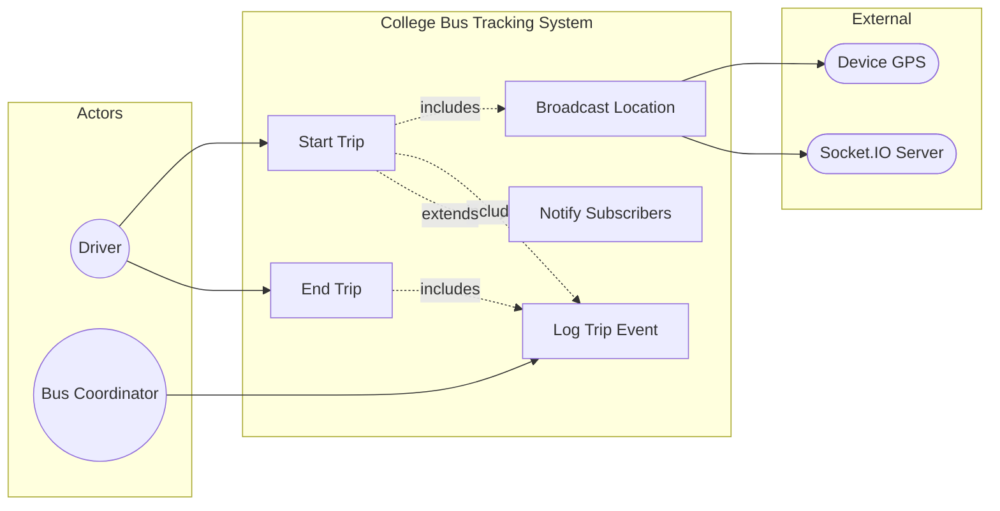

# UC3: Start and End Trip

**Use Case ID:** UC3  
**Use Case Name:** Start and End Trip  
**Version:** 1.0  
**Date:** 2025-12-29

---

## 1. Purpose

This use case describes the workflow for a Driver to initiate and conclude a bus trip. Starting a trip activates real-time location broadcasting, while ending a trip stops location updates and logs trip completion for historical records.

---

## 2. Use Case Diagram

---

## 3. Actors

| Actor             | Type      | Description                                                    |
| ----------------- | --------- | -------------------------------------------------------------- |
| Driver            | Primary   | The bus operator responsible for starting and ending trips.    |
| Coordinator/Admin | Secondary | Assigns buses and routes to drivers.                           |
| Socket.IO Server  | Secondary | Facilitates real-time communication for location broadcasting. |
| Location Service  | Secondary | Device GPS service providing coordinates.                      |

---

## 3. Preconditions

1. The Driver is authenticated and logged into the mobile application.
2. The Driver has been assigned to a specific bus (`busId`) and route (`routeId`) by the Coordinator.
3. The Driver has accepted the bus assignment (assignment status is `accepted`).
4. Location permissions are granted on the Driver's device.

---

## 4. Main Flow

| Step | Actor            | Action                                                                                                |
| ---- | ---------------- | ----------------------------------------------------------------------------------------------------- |
| 1    | Driver           | Opens the Driver Dashboard in the mobile application.                                                 |
| 2    | System           | Displays the assigned bus, route, and a "Start Trip" button.                                          |
| 3    | Driver           | Taps "Start Trip".                                                                                    |
| 4    | Mobile App       | Requests current GPS location from the device.                                                        |
| 5    | Mobile App       | Sends a `tripStarted` event via Socket.IO to the backend.                                             |
| 6    | Backend          | Updates `Bus.status` to `on-time` and creates a `History` log entry with `eventType: trip_status`.    |
| 7    | Socket.IO Server | Broadcasts a `busStatusUpdate` event to all subscribers on the route's room.                          |
| 8    | Mobile App       | Starts a foreground service to continuously track and emit location updates.                          |
| 9    | Driver           | Operates the bus along the route. Location is broadcast at regular intervals (e.g., every 5 seconds). |
| 10   | Driver           | Upon reaching the final destination, taps "End Trip".                                                 |
| 11   | Mobile App       | Sends a `tripEnded` event via Socket.IO.                                                              |
| 12   | Backend          | Updates `Bus.status` to `not-running`, logs trip completion in `History` and `BusAssignmentLog`.      |
| 13   | Mobile App       | Stops the foreground location service.                                                                |

---

## 5. Alternative Flows / Exceptions

### AF1: Location Permission Denied

| Step | Action                                                                                           |
| ---- | ------------------------------------------------------------------------------------------------ |
| 4a   | Device denies location access.                                                                   |
| 4b   | Mobile App displays "Location permission is required to start a trip." and prompts for settings. |

### AF2: Bus Already on Active Trip

| Step | Action                                                                 |
| ---- | ---------------------------------------------------------------------- |
| 5a   | Backend detects `Bus.status` is already `on-time` (trip active).       |
| 5b   | System returns an error: "A trip is already in progress for this bus." |

### AF3: Network Disconnection During Trip

| Step | Action                                                       |
| ---- | ------------------------------------------------------------ |
| 8a   | Network connection is lost during the trip.                  |
| 8b   | Mobile App caches location updates locally.                  |
| 8c   | Upon reconnection, cached updates are synced to the backend. |

---

## 6. Modules / Components Represented

| Component                | Role in Use Case                                                                                                                                                          |
| ------------------------ | ------------------------------------------------------------------------------------------------------------------------------------------------------------------------- |
| **Mobile App (Flutter)** | `lib/screens/driver/driver_dashboard.dart` - Trip control UI. `lib/services/location_service.dart` - GPS tracking. `lib/services/socket_service.dart` - Real-time events. |
| **Backend (Node.js)**    | `src/socket.ts` - Handles `tripStarted`, `tripEnded` events. `src/controllers/busController.ts` - Updates bus status.                                                     |
| **Database (MongoDB)**   | `Bus` collection - `status` field updated. `History` collection - Trip logs. `BusAssignmentLog` - Assignment completion.                                                  |

---

## 7. Notes

- **Real-time Interaction:** Starting a trip triggers real-time location broadcasting; ending it stops the broadcast.
- **State Transition:** This use case directly triggers state changes in the `Bus` entity as documented in the State Machine Diagram recommendation.
- **Academic Detail:** The "Start Trip" action exemplifies a "Command" pattern where an action object encapsulates the request to change system state.
