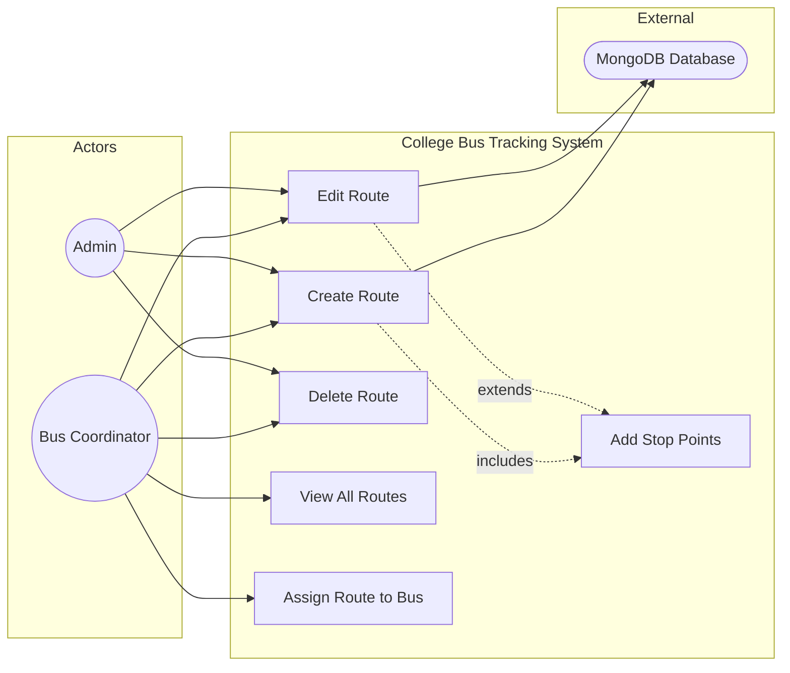

# UC4: Manage Bus Routes

**Use Case ID:** UC4  
**Use Case Name:** Manage Bus Routes  
**Version:** 1.0  
**Date:** 2025-12-29

---

## 1. Purpose

This use case describes how an Admin or Bus Coordinator can create, view, update, and delete bus routes within the system. Routes define the geographical path a bus follows, including its start point, end point, and intermediate stops.

---

## 2. Use Case Diagram

---

## 3. Actors

| Actor               | Type      | Description                                                        |
| ------------------- | --------- | ------------------------------------------------------------------ |
| Admin / Coordinator | Primary   | Authorized personnel responsible for defining and managing routes. |
| System              | Secondary | Backend services that persist route data and validate inputs.      |
| Google Maps API     | External  | Provides geocoding and map visualization for route planning.       |

---

## 3. Preconditions

1. The Admin/Coordinator is authenticated with an appropriate role (`admin` or `busCoordinator`).
2. The user has navigated to the Route Management section of the application.
3. For updates/deletions: The target route must exist in the system.

---

## 4. Main Flow (Create Route)

| Step | Actor   | Action                                                                                                  |
| ---- | ------- | ------------------------------------------------------------------------------------------------------- |
| 1    | Admin   | Navigates to "Routes" section and selects "Add New Route".                                              |
| 2    | System  | Displays a form with fields: Route Name, Route Type (Pickup/Drop), Start Point, End Point, Stop Points. |
| 3    | Admin   | Enters route name and type.                                                                             |
| 4    | Admin   | Uses the map interface to select Start Point and End Point locations.                                   |
| 5    | Admin   | Adds intermediate Stop Points by tapping on the map or entering addresses.                              |
| 6    | System  | Geocodes addresses to `{ lat, lng }` coordinates via Google Maps API.                                   |
| 7    | Admin   | Submits the form.                                                                                       |
| 8    | System  | Sends an HTTP POST request to `/api/routes` with the route data.                                        |
| 9    | Backend | Validates data and creates a new document in the `Route` collection.                                    |
| 10   | System  | Displays success message and the new route appears in the list.                                         |

---

## 5. Alternative Flows / Exceptions

### AF1: Update Existing Route

| Step | Action                                                           |
| ---- | ---------------------------------------------------------------- |
| 1    | Admin selects an existing route from the list and clicks "Edit". |
| 2    | System pre-fills the form with existing route data.              |
| 3    | Admin modifies fields (e.g., adds a new stop).                   |
| 4    | System sends HTTP PUT to `/api/routes/:routeId`.                 |
| 5    | Backend updates the document.                                    |

### AF2: Delete Route

| Step | Action                                                                    |
| ---- | ------------------------------------------------------------------------- |
| 1    | Admin selects a route and clicks "Delete".                                |
| 2    | System prompts for confirmation.                                          |
| 3    | Admin confirms.                                                           |
| 4    | System sends HTTP DELETE to `/api/routes/:routeId`.                       |
| 5    | Backend checks if buses are assigned to this route.                       |
| 5a   | If assigned, return error: "Cannot delete route with active assignments." |
| 5b   | If not assigned, delete the route.                                        |

### AF3: Validation Error

| Step | Action                                                   |
| ---- | -------------------------------------------------------- |
| 8a   | Backend validation fails (e.g., missing required field). |
| 8b   | System returns HTTP 400 with validation errors.          |
| 8c   | Mobile App displays error messages on the form.          |

---

## 6. Modules / Components Represented

| Component                | Role in Use Case                                                                            |
| ------------------------ | ------------------------------------------------------------------------------------------- |
| **Mobile App (Flutter)** | `lib/screens/coordinator/` - Route management UI. Map picker widgets.                       |
| **Backend (Node.js)**    | `src/controllers/routeController.ts` - CRUD logic. `src/routes/routeRoutes.ts` - Endpoints. |
| **Database (MongoDB)**   | `Route` collection - Stores route definitions with embedded stop points.                    |
| **External API**         | Google Maps Geocoding API - Converts addresses to coordinates.                              |

---

## 7. Notes

- **Real-time Interaction:** Route changes do not require real-time updates but may trigger notifications to affected drivers.
- **Data Integrity:** Routes with active bus assignments cannot be deleted to maintain referential integrity.
- **Academic Detail:** This CRUD use case follows the "Repository" pattern for data access abstraction.
