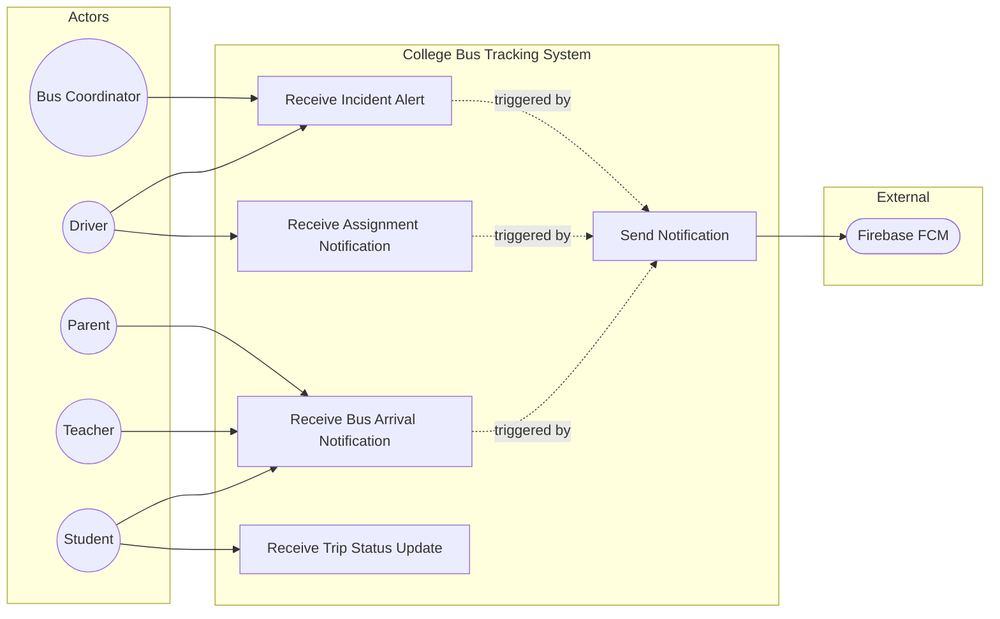

# UC5: Receive Push Notifications

**Use Case ID:** UC5  
**Use Case Name:** Receive Push Notifications  
**Version:** 1.0  
**Date:** 2025-12-29

---

## 1. Purpose

This use case describes how users receive timely push notifications about relevant bus tracking events. Notifications include bus arrival alerts, assignment updates for drivers, incident reports, and administrative announcements.

---

## 2. Use Case Diagram

---

## 3. Actors

| Actor                          | Type      | Description                                       |
| ------------------------------ | --------- | ------------------------------------------------- |
| User (All Roles)               | Primary   | Recipient of push notifications.                  |
| System (Backend)               | Secondary | Triggers and sends notifications based on events. |
| Firebase Cloud Messaging (FCM) | External  | Google's push notification delivery service.      |

---

## 3. Preconditions

1. The user is registered and has an FCM token stored in their profile.
2. The mobile application has notification permissions enabled.
3. The device is connected to the internet.
4. A triggering event has occurred (e.g., bus approaching stop, assignment created).

---

## 4. Main Flow

| Step | Actor        | Action                                                                                                  |
| ---- | ------------ | ------------------------------------------------------------------------------------------------------- |
| 1    | System Event | A relevant event occurs (e.g., bus is within 500m of a student's stop).                                 |
| 2    | Backend      | Identifies affected users based on the event type and their profile data (e.g., `stopId`, `routeId`).   |
| 3    | Backend      | Retrieves the `fcmToken` for each target user from the `User` collection.                               |
| 4    | Backend      | Constructs a notification payload with `title`, `body`, and optional `data` (e.g., `busId`, `routeId`). |
| 5    | Backend      | Sends the payload to FCM via Firebase Admin SDK.                                                        |
| 6    | FCM          | Delivers the notification to the user's device.                                                         |
| 7    | Mobile App   | Receives the notification (foreground or background).                                                   |
| 8    | Mobile App   | Displays a system notification or in-app toast based on app state.                                      |
| 9    | User         | Taps the notification to navigate to the relevant screen (e.g., Map, Assignments).                      |

---

## 5. Alternative Flows / Exceptions

### AF1: App in Foreground

| Step | Action                                                                                                                |
| ---- | --------------------------------------------------------------------------------------------------------------------- |
| 7a   | App is in the foreground when notification arrives.                                                                   |
| 7b   | App handles the notification via `onMessage` listener and displays an in-app banner instead of a system notification. |

### AF2: Invalid FCM Token

| Step | Action                                                                        |
| ---- | ----------------------------------------------------------------------------- |
| 5a   | FCM returns an error indicating an invalid or expired token.                  |
| 5b   | Backend logs the error and may clear the stale token from the user's profile. |

### AF3: Notification Permissions Denied

| Step | Action                                                                       |
| ---- | ---------------------------------------------------------------------------- |
| 7a   | Device has notification permissions disabled.                                |
| 7b   | Notification is not displayed. User remains unaware until they open the app. |

---

## 6. Modules / Components Represented

| Component                | Role in Use Case                                                                                                                                          |
| ------------------------ | --------------------------------------------------------------------------------------------------------------------------------------------------------- |
| **Mobile App (Flutter)** | `lib/services/firebase_service.dart` - FCM initialization and token retrieval. `lib/services/notification_service.dart` - Handles incoming notifications. |
| **Backend (Node.js)**    | `src/services/notificationService.ts` - Constructs and sends notifications. `src/config/firebase.ts` - Firebase Admin SDK setup.                          |
| **Database (MongoDB)**   | `User.fcmToken` - Stores device token. `Notification` collection - Logs sent notifications.                                                               |
| **External Service**     | Firebase Cloud Messaging - Handles message delivery.                                                                                                      |

---

## 7. Notes

- **Real-time Interaction:** Notifications are near real-time, typically delivered within seconds of the triggering event.
- **Types of Notifications:**
  - `bus_arriving`: Sent to students/teachers when bus is near their stop.
  - `assignment_update`: Sent to drivers for new/rejected assignments.
  - `incident_alert`: Sent to coordinators for reported incidents.
  - `sos_alert`: High-priority alert for emergencies.
- **Academic Detail:** This use case implements the "Publish-Subscribe" messaging pattern via FCM.
