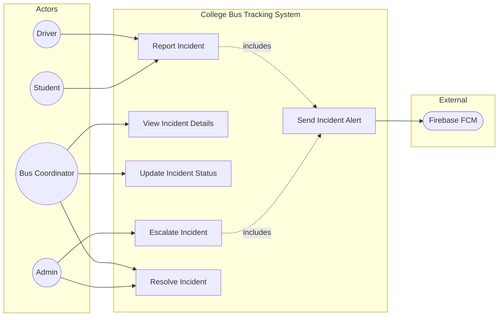

# UC6: Report Incident

**Use Case ID:** UC6  
**Use Case Name:** Report Incident  
**Version:** 1.0  
**Date:** 2025-12-29

---

## 1. Purpose

This use case describes how users (primarily Drivers, but also Students or Teachers) can report incidents related to the bus service. Incidents may include accidents, breakdowns, delays, or behavioral issues. Reported incidents are logged and escalated to Coordinators/Admins for resolution.

---

## 2. Use Case Diagram

---

## 3. Actors

| Actor                             | Type      | Description                                       |
| --------------------------------- | --------- | ------------------------------------------------- |
| Reporter (Driver/Student/Teacher) | Primary   | The user who observes and reports the incident.   |
| Coordinator / Admin               | Secondary | Receives incident reports and manages resolution. |
| Notification Service              | Secondary | Sends alerts to relevant personnel.               |

---

## 3. Preconditions

1. The Reporter is authenticated and logged into the application.
2. The Reporter has observed an incident worth reporting.
3. For Drivers: A trip is ideally active, allowing the system to associate the incident with a specific bus and route.

---

## 4. Main Flow

| Step | Actor      | Action                                                                                                                                                    |
| ---- | ---------- | --------------------------------------------------------------------------------------------------------------------------------------------------------- |
| 1    | Reporter   | Navigates to the "Report Incident" screen via the app menu or dashboard.                                                                                  |
| 2    | System     | Displays a form with fields: Incident Type (Dropdown), Description (Text), Severity (Dropdown).                                                           |
| 3    | Reporter   | Selects the incident type (Accident, Breakdown, Delay, Behavior, Other).                                                                                  |
| 4    | Reporter   | Enters a detailed description of the incident.                                                                                                            |
| 5    | Reporter   | Selects severity level (Low, Medium, High, Critical).                                                                                                     |
| 6    | System     | Automatically captures current GPS location (if available).                                                                                               |
| 7    | Reporter   | Submits the report.                                                                                                                                       |
| 8    | Mobile App | Sends HTTP POST to `/api/incidents` with payload including `collegeId`, `busId`, `driverId`, `reporterId`, `type`, `description`, `severity`, `location`. |
| 9    | Backend    | Creates a new document in the `Incident` collection with status `open`.                                                                                   |
| 10   | Backend    | Triggers Notification Service to send a push notification to Coordinators.                                                                                |
| 11   | System     | Displays success message: "Incident reported successfully."                                                                                               |

---

## 5. Alternative Flows / Exceptions

### AF1: SOS / Emergency Report

| Step | Action                                                                             |
| ---- | ---------------------------------------------------------------------------------- |
| 1    | Driver taps a dedicated "SOS" button (separate from standard reporting).           |
| 2    | System automatically captures location and pre-fills type as "Critical Emergency". |
| 3    | Backend sends high-priority notifications to all Admins and Coordinators.          |
| 4    | Backend may also trigger an automated email or SMS alert.                          |

### AF2: Location Unavailable

| Step | Action                                                        |
| ---- | ------------------------------------------------------------- |
| 6a   | GPS is unavailable or permission denied.                      |
| 6b   | System allows submission without location but logs a warning. |
| 6c   | Report is submitted with `location: null`.                    |

### AF3: Incident Resolution

| Step | Action                                                                      |
| ---- | --------------------------------------------------------------------------- |
| 1    | Coordinator views open incidents in the Admin dashboard.                    |
| 2    | Coordinator reviews details and takes action.                               |
| 3    | Coordinator updates status to `investigating` or `resolved`.                |
| 4    | System sends notification to the original Reporter about the status change. |

---

## 6. Modules / Components Represented

| Component                | Role in Use Case                                                                                                                                           |
| ------------------------ | ---------------------------------------------------------------------------------------------------------------------------------------------------------- |
| **Mobile App (Flutter)** | `lib/screens/shared/report_incident_screen.dart` - Reporting UI. `lib/services/incident_service.dart` - API calls.                                         |
| **Backend (Node.js)**    | `src/controllers/incidentController.ts` - Create/Update logic. `src/routes/incidentRoutes.ts` - Endpoints. `src/services/notificationService.ts` - Alerts. |
| **Database (MongoDB)**   | `Incident` collection - Stores incident records with status lifecycle.                                                                                     |

---

## 7. Notes

- **Real-time Interaction:** Incident reports trigger immediate push notifications to Coordinators.
- **State Lifecycle:** `Incident.status` transitions: `open` -> `investigating` -> `resolved`.
- **Academic Detail:** This use case demonstrates the "Event-Driven" architecture pattern, where a user action (incident report) triggers downstream system behaviors (notifications, logging).
