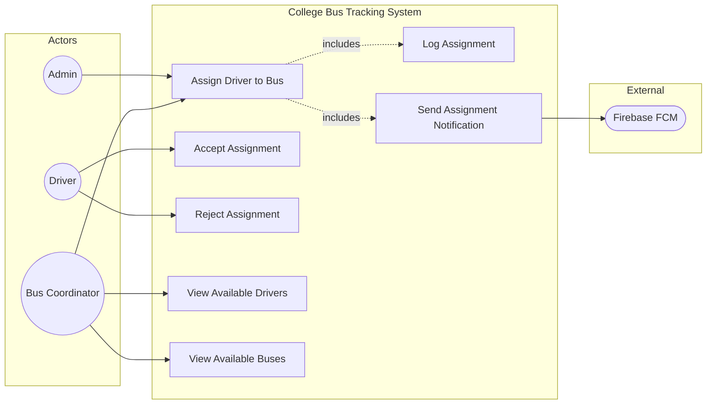

# UC7: Assign Driver to Bus

**Use Case ID:** UC7  
**Use Case Name:** Assign Driver to Bus  
**Version:** 1.0  
**Date:** 2025-12-29

---

## 1. Purpose

This use case describes the process by which a Coordinator assigns a Driver to a specific Bus and optionally a Route. This is a critical administrative function that establishes the operational relationship between personnel and vehicles.

---

## 2. Use Case Diagram

---

## 3. Actors

| Actor                | Type      | Description                                                                       |
| -------------------- | --------- | --------------------------------------------------------------------------------- |
| Coordinator / Admin  | Primary   | Authorized user who manages bus-driver assignments.                               |
| Driver               | Secondary | The user being assigned to the bus. Receives notification and must accept/reject. |
| Notification Service | Secondary | Sends assignment notifications to the Driver.                                     |

---

## 3. Preconditions

1. The Coordinator is authenticated with a `busCoordinator` or `admin` role.
2. The target Driver exists in the system with role `driver` and `approved: true`.
3. The target Bus exists and is not currently assigned to another driver (or the Coordinator intends to reassign).
4. The target Route (if specified) exists in the system.

---

## 4. Main Flow

| Step | Actor       | Action                                                                               |
| ---- | ----------- | ------------------------------------------------------------------------------------ |
| 1    | Coordinator | Navigates to the "Buses" or "Assignments" section in the app.                        |
| 2    | System      | Displays a list of buses with their current assignment status.                       |
| 3    | Coordinator | Selects a bus marked as `unassigned` or chooses to reassign.                         |
| 4    | System      | Displays a driver selection modal with available (approved) drivers.                 |
| 5    | Coordinator | Selects a driver from the list.                                                      |
| 6    | System      | Optionally displays a route selection modal.                                         |
| 7    | Coordinator | Selects a route (or skips to assign without a route).                                |
| 8    | Coordinator | Confirms the assignment.                                                             |
| 9    | Mobile App  | Sends HTTP POST/PUT to `/api/buses/:busId/assign` with `driverId` and `routeId`.     |
| 10   | Backend     | Updates `Bus.driverId`, `Bus.routeId`, and sets `Bus.assignmentStatus` to `pending`. |
| 11   | Backend     | Creates a `BusAssignmentLog` entry with status `pending`.                            |
| 12   | Backend     | Sends push notification to the Driver via FCM.                                       |
| 13   | System      | Displays success: "Assignment sent. Awaiting driver acceptance."                     |

---

## 5. Alternative Flows / Exceptions

### AF1: Driver Accepts Assignment

| Step | Action                                                                               |
| ---- | ------------------------------------------------------------------------------------ |
| 1    | Driver receives push notification and opens the app.                                 |
| 2    | Driver views the assignment details on their dashboard.                              |
| 3    | Driver taps "Accept".                                                                |
| 4    | Mobile App sends request to `/api/buses/:busId/accept-assignment`.                   |
| 5    | Backend updates `Bus.assignmentStatus` to `accepted` and logs in `BusAssignmentLog`. |
| 6    | Backend notifies the Coordinator of acceptance.                                      |

### AF2: Driver Rejects Assignment

| Step | Action                                                                     |
| ---- | -------------------------------------------------------------------------- |
| 3    | Driver taps "Reject".                                                      |
| 4    | Mobile App sends request to `/api/buses/:busId/reject-assignment`.         |
| 5    | Backend updates `Bus.assignmentStatus` to `unassigned`, clears `driverId`. |
| 6    | Backend notifies the Coordinator of rejection.                             |

### AF3: Route Conflict Detection

| Step | Action                                                                           |
| ---- | -------------------------------------------------------------------------------- |
| 7a   | Selected route is already assigned to another bus for the same schedule.         |
| 7b   | System displays warning: "Route X is already assigned to Bus Y. Proceed anyway?" |
| 7c   | Coordinator confirms or selects a different route.                               |

---

## 6. Modules / Components Represented

| Component                | Role in Use Case                                                                                   |
| ------------------------ | -------------------------------------------------------------------------------------------------- |
| **Mobile App (Flutter)** | `lib/screens/coordinator/` - Assignment UI. `lib/services/bus_service.dart` - API calls.           |
| **Backend (Node.js)**    | `src/controllers/busController.ts` - Assignment logic. `src/socket.ts` - Real-time updates.        |
| **Database (MongoDB)**   | `Bus` collection - `driverId`, `routeId`, `assignmentStatus`. `BusAssignmentLog` - Historical log. |

---

## 7. Notes

- **Real-time Interaction:** Driver receives immediate notification. Status updates are reflected in real-time on the Coordinator's dashboard via Socket.IO.
- **State Transitions:** `Bus.assignmentStatus`: `unassigned` -> `pending` -> `accepted` / `unassigned` (on rejection).
- **Academic Detail:** This implements a basic "Workflow" pattern with request, pending state, and acceptance/rejection outcomes.
