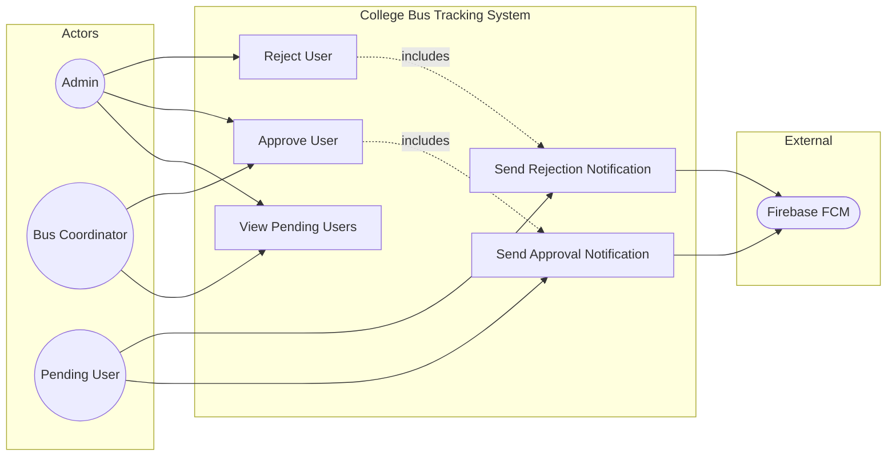

# UC8: Manage User Approvals

**Use Case ID:** UC8  
**Use Case Name:** Manage User Approvals  
**Version:** 1.0  
**Date:** 2025-12-29

---

## 1. Purpose

This use case describes how an Admin reviews and approves (or rejects) newly registered user accounts. This is a security and access control mechanism ensuring that only verified individuals can access the bus tracking system.

---

## 2. Use Case Diagram

---

## 3. Actors

| Actor                | Type      | Description                                               |
| -------------------- | --------- | --------------------------------------------------------- |
| Admin                | Primary   | The system administrator responsible for user management. |
| Pending User         | Secondary | A newly registered user awaiting approval.                |
| Notification Service | Secondary | Sends approval/rejection notifications to users.          |

---

## 3. Preconditions

1. The Admin is authenticated with the `admin` role.
2. One or more users have registered but have `approved: false` in their profile.
3. The Admin navigates to the User Management section.

---

## 4. Main Flow

| Step | Actor      | Action                                                                                       |
| ---- | ---------- | -------------------------------------------------------------------------------------------- |
| 1    | Admin      | Navigates to "User Management" -> "Pending Approvals".                                       |
| 2    | System     | Fetches and displays a list of users with `approved: false` and `needsManualApproval: true`. |
| 3    | Admin      | Reviews user details (Name, Email, Role, College, Registration Date).                        |
| 4    | Admin      | Selects a user and taps "Approve" or "Reject".                                               |
| 5    | Mobile App | Sends HTTP PUT to `/api/users/:userId/approve` or `/api/users/:userId/reject`.               |
| 6    | Backend    | Updates `User.approved` to `true` (or deletes/flags the user on rejection).                  |
| 7    | Backend    | Sets `User.approverId` to the Admin's ID.                                                    |
| 8    | Backend    | Sends a push notification to the user about the decision.                                    |
| 9    | System     | Refreshes the list, removing the approved/rejected user from pending.                        |

---

## 5. Alternative Flows / Exceptions

### AF1: Bulk Approval

| Step | Action                                                          |
| ---- | --------------------------------------------------------------- |
| 4    | Admin selects multiple users via checkboxes.                    |
| 5    | Admin taps "Approve All Selected".                              |
| 6    | System sends batch request to backend.                          |
| 7    | Backend processes each user and sends individual notifications. |

### AF2: Rejection with Reason

| Step | Action                                                                   |
| ---- | ------------------------------------------------------------------------ |
| 4    | Admin selects "Reject".                                                  |
| 5    | System prompts for a rejection reason (optional text).                   |
| 6    | Admin enters reason and confirms.                                        |
| 7    | Backend logs the reason and includes it in the notification to the user. |

### AF3: Auto-Approval (Email Domain)

| Step | Action                                                                        |
| ---- | ----------------------------------------------------------------------------- |
| 1    | During registration, user's email domain matches college's `allowedDomains`.  |
| 2    | Backend automatically sets `approved: true` and `needsManualApproval: false`. |
| 3    | User does not appear in the pending list; they can login immediately.         |

---

## 6. Modules / Components Represented

| Component                | Role in Use Case                                                                              |
| ------------------------ | --------------------------------------------------------------------------------------------- |
| **Mobile App (Flutter)** | `lib/screens/admin/` - User management UI. `lib/services/admin_service.dart` - API calls.     |
| **Backend (Node.js)**    | `src/controllers/userController.ts` - Approval logic. `src/routes/userRoutes.ts` - Endpoints. |
| **Database (MongoDB)**   | `User` collection - `approved`, `needsManualApproval`, `approverId` fields.                   |

---

## 7. Notes

- **Security:** Only users with `approved: true` can successfully authenticate and access the system.
- **Audit Trail:** `approverId` field provides accountability for who approved each user.
- **Academic Detail:** This implements the "Gatekeeper" security pattern, where a privileged actor controls access to the system.
