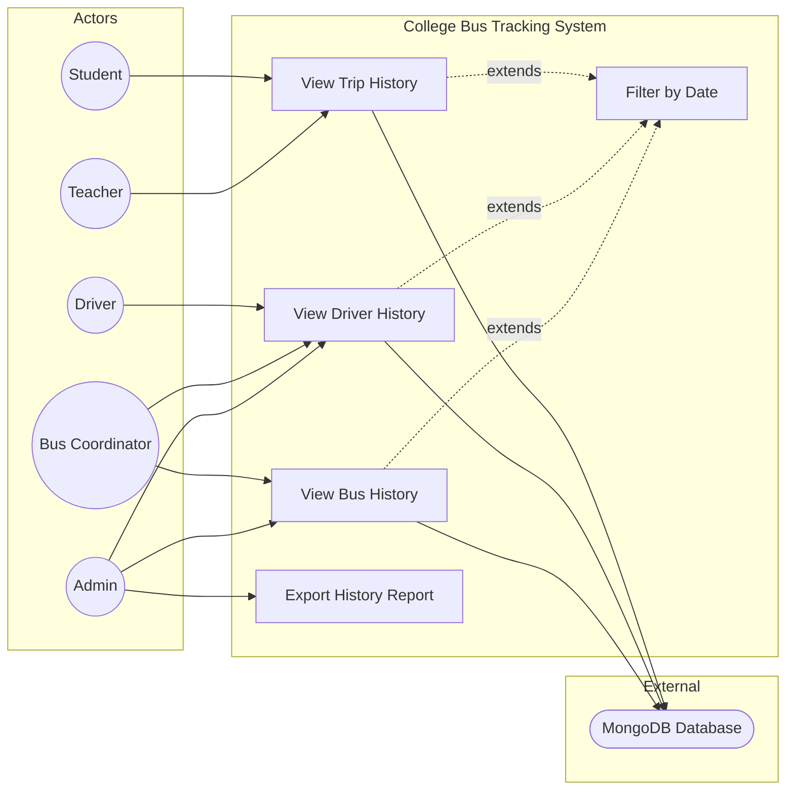

# UC9: View Trip History

**Use Case ID:** UC9  
**Use Case Name:** View Trip History  
**Version:** 1.0  
**Date:** 2025-12-29

---

## 1. Purpose

This use case describes how users (Students, Teachers, Drivers, Admins) can view historical records of past trips. This includes trip timings, routes taken, and events logged during trips. It is essential for auditing, reporting, and operational analysis.

---

## 2. Use Case Diagram

---

## 3. Actors

| Actor            | Type      | Description                                             |
| ---------------- | --------- | ------------------------------------------------------- |
| User (All Roles) | Primary   | Any authenticated user viewing their relevant history.  |
| System           | Secondary | Backend services that query and return historical data. |

---

## 3. Preconditions

1. The user is authenticated.
2. Historical trip data exists in the system (`History`, `BusAssignmentLog` collections).
3. The user navigates to the History/Logs section of the application.

---

## 4. Main Flow

| Step | Actor               | Action                                                                                        |
| ---- | ------------------- | --------------------------------------------------------------------------------------------- |
| 1    | User                | Navigates to "History" or "Trip Logs" section.                                                |
| 2    | System              | Determines user's role and fetches relevant history.                                          |
| 2a   | (Student/Teacher)   | Fetches history for trips on the user's assigned route.                                       |
| 2b   | (Driver)            | Fetches history for trips operated by the driver.                                             |
| 2c   | (Admin/Coordinator) | Fetches all history for the college, with filtering options.                                  |
| 3    | System              | Sends HTTP GET to `/api/history` with query parameters (role, routeId, driverId, date range). |
| 4    | Backend             | Queries `History` and/or `BusAssignmentLog` collections.                                      |
| 5    | Backend             | Returns a paginated list of history entries.                                                  |
| 6    | System              | Displays the history in a list/card format with date, event type, and description.            |
| 7    | User                | Selects an entry to view details.                                                             |
| 8    | System              | Displays full details including metadata (e.g., bus number, route name, timestamps).          |

---

## 5. Alternative Flows / Exceptions

### AF1: Filter by Date Range

| Step | Action                                                |
| ---- | ----------------------------------------------------- |
| 1    | User taps a "Filter" button.                          |
| 2    | System displays date picker for start and end dates.  |
| 3    | User selects dates and applies filter.                |
| 4    | System re-fetches data with the specified date range. |

### AF2: Filter by Event Type

| Step | Action                                                                                             |
| ---- | -------------------------------------------------------------------------------------------------- |
| 1    | User selects an event type from a dropdown (e.g., "trip_status", "assignment_update", "incident"). |
| 2    | System re-fetches data filtered by `eventType`.                                                    |

### AF3: No History Found

| Step | Action                                                             |
| ---- | ------------------------------------------------------------------ |
| 5a   | Backend returns an empty array.                                    |
| 5b   | System displays "No trip history found for the selected criteria." |

---

## 6. Modules / Components Represented

| Component                | Role in Use Case                                                                                                            |
| ------------------------ | --------------------------------------------------------------------------------------------------------------------------- |
| **Mobile App (Flutter)** | `lib/screens/shared/history_screen.dart` or role-specific history screens. `lib/services/history_service.dart` - API calls. |
| **Backend (Node.js)**    | `src/controllers/historyController.ts` - Query logic with filtering. `src/routes/historyRoutes.ts` - Endpoints.             |
| **Database (MongoDB)**   | `History` collection - Stores all logged events. `BusAssignmentLog` - Stores assignment lifecycle.                          |

---

## 7. Notes

- **Real-time Interaction:** This is a read-only use case; no real-time updates are typically needed.
- **Data Source:** Entries are created by other use cases (UC3, UC6, UC7) and consumed here for reporting.
- **Academic Detail:** This use case demonstrates the "Query" pattern from CQRS (Command Query Responsibility Segregation), where the read model is separate from the write operations.
