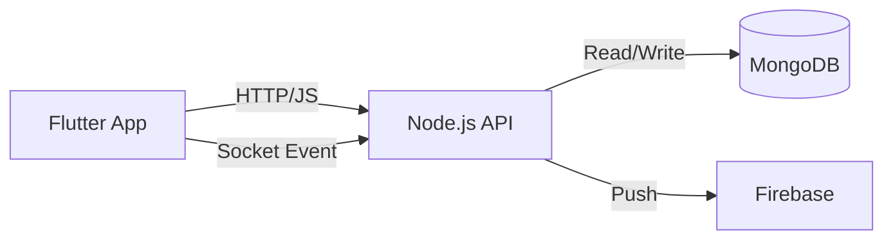

# College Bus Tracking System - Final Project Presentation

**Format**: Markdown Blueprint for PowerPoint  
**Style**: IEEE Academic / Professional  
**Color Palette**:

- **Primary**: Deep Blue (#0D47A1)
- **Secondary**: Amber/Orange (#FF6F00) - for accents
- **Background**: White (#FFFFFF) or Light Grey (#F5F5F5)
- **Text**: Dark Slate (#212121)  
  **Fonts**:
- **Headings**: Montserrat or Roboto (Bold)
- **Body**: Open Sans or Lato (Regular)
- **Code/Tech**: Fira Code or Consolas

---

## Slide 1: Title Slide

**Title**: College Bus Tracking System  
**Subtitle**: A Real-Time Location Tracking Solution for Educational Institutions

**Content**:

- **Student Name**: [Your Name]
- **Roll Number**: [Your Roll No]
- **Supervisor**: [Supervisor Name]
- **Department**: Department of ECE / CSE
- **Institution**: [College/University Name]
- **Year**: 2025

| **Design & Layout**                                                                                                                                                                                          | **Animations**                                                                                                              |
| :----------------------------------------------------------------------------------------------------------------------------------------------------------------------------------------------------------- | :-------------------------------------------------------------------------------------------------------------------------- |
| **Background**: Clean white with a subtle geometric sidebar in Primary Blue.   **Elements**: College Logo (Top Left), Dept Logo (Top Right).   **Text**: Center aligned. Assignment details at bottom. | **Title**: Fade In (1.0s)   **Subtitle**: Wipe From Left (After Title)   **Details**: Fly In from Bottom (0.5s delay) |

**Presenter Notes**:

> "Good morning everyone. Today, I am presenting my final year project titled 'College Bus Tracking System'. This system is designed to bridge the visibility gap in daily college commutes using modern mobile and web technologies."

---

## Slide 2: Problem Statement & Motivation

**Title**: The Need for Real-Time Tracking

**Content**:

- **Current Scenario**:
  - Lack of visibility: Students wait indefinitely at stops.
  - Communication gaps: Parents worry about delays without updates.
  - Inefficient management: Coordinators rely on phone calls to locate drivers.
- **Motivation**:
  - To ensure student safety through monitoring.
  - To optimize waiting times and reduce anxiety.
  - To digitize fleet management for the college administration.

| **Design & Layout**                                                                                                                  | **Animations**                                                            |
| :----------------------------------------------------------------------------------------------------------------------------------- | :------------------------------------------------------------------------ |
| **Visual**: Split screen. Left side text bullet points. Right side detailed icon or illustration of a "Waiting Person" with a clock. | **Bullets**: Float In one by one on click.   **Image**: Zoom In (Soft) |

**Presenter Notes**:

> "The core motivation stems from the daily struggle of students waiting at bus stops without knowing if the bus is late. Our solution aims to eliminate this uncertainty and provide a secure monitoring channel for administrators."

---

## Slide 3: Project Objectives

**Title**: Key Objectives

**Content**:

1.  **Real-Time Tracking**: Provide live GPS updates with < 5s latency.
2.  **Role-Based Access**: Secure portals for Students, Drivers, Coordinators, and Admins.
3.  **Automated Alerts**: Push notifications for arrival, delays, and emergencies.
4.  **Route Management**: Dynamic tools for assigning drivers and routes.

| **Design & Layout**                                                                                         | **Animations**                           |
| :---------------------------------------------------------------------------------------------------------- | :--------------------------------------- |
| **Visual**: 4 Quadrants or Horizontal Cards. Each objective has a relevant icon (Map, Shield, Bell, Route). | **Cards**: Flip or Fade In sequentially. |

**Presenter Notes**:

> "Our specific objectives were: first, to achieve low-latency tracking; second, to ensure strict access control; third, to automate communication via notifications; and finally, to digitize the manual route allocation process."

---

## Slide 4: Technology Stack

**Title**: Tools & Technologies

**Content**:

- **Frontend (Mobile)**: Flutter (Dart) - Cross-platform (iOS/Android).
- **Backend**: Node.js & Express (TypeScript) - REST APIs.
- **Real-Time Engine**: Socket.IO - Bidirectional event streaming.
- **Database**: MongoDB - NoSQL document storage.
- **Infrastucture**:
  - Google Maps API (Rendering & Geocoding)
  - Firebase FCM (Push Notifications)

| **Design & Layout**                                                                                                                              | **Animations**                                                                               |
| :----------------------------------------------------------------------------------------------------------------------------------------------- | :------------------------------------------------------------------------------------------- |
| **Visual**: Tech Stack Diagram. Logos arranged in layers (Client, Server, Database).   **Icons**: Flutter, Node.js, MongoDB, Socket.IO logos. | **Logos**: Pop Up or Bounce In.   **Connectors**: Wipe Left to Right to show integration. |

**Presenter Notes**:

> "We chose Flutter for its native performance on both Android and iOS. The backend allows for non-blocking I/O using Node.js, which is perfect for handling thousands of concurrent socket connections for tracking."

---

## Slide 5: System Overview (Architecture)

**Title**: High-Level System Architecture

**Content**:
_(Image Placeholder: [PKG1_System_Overview.png](../diagrams/exports/PKG1_System_Overview.png))_

- **Mobile App**: Handles UI and Location Services.
- **API Server**: Manages Auth, Data, and Real-time logic.
- **External Services**: Google Maps for tiles, Firebase for alerts.

| **Design & Layout**                                                          | **Animations**                                                                     |
| :--------------------------------------------------------------------------- | :--------------------------------------------------------------------------------- |
| **Visual**: Large central diagram. Callout boxes pointing to key components. | **Diagram**: Fade In.   **Arrows**: Wipe animation to show data flow direction. |

**Presenter Notes**:

> "Here is the high-level architecture. The mobile app communicates with the Node.js server via both REST APIs for standard data and Socket.IO for live location streams. We leverage MongoDB for scalable data storage."

---

## Slide 6: User Roles

**Title**: Stakeholders & Roles

**Content**:

- **Student / Parent**:
  - View Live Location & ETA.
  - Receive Notifications.
- **Driver**:
  - Broadcast Location.
  - Manage Trip Status (Start/Stop).
- **Bus Coordinator**:
  - Assign Drivers to Buses.
  - Manage Routes.
- **Admin**:
  - System Oversight.
  - User Approvals.

| **Design & Layout**                                                                              | **Animations**                                             |
| :----------------------------------------------------------------------------------------------- | :--------------------------------------------------------- |
| **Visual**: 4 Column Layout with Role Avatars at the top. Key features listed below each avatar. | **Columns**: Rise Up (Float) from bottom, staggered delay. |

**Presenter Notes**:

> "The system caters to four distinct roles. While Students consume data, Drivers allow the system to generate data. Coordinators and Admins act as the control plane for managing these resources."

---

## Slide 7: Real-Time Tracking Flow

**Title**: How Real-Time Tracking Works

**Content**:
_(Image Placeholder: [RT_Architecture_College_Bus_Tracking_System.png](../diagrams/exports/RT_Architecture_College_Bus_Tracking_System.png))_

1.  **Emit**: Driver phone sends GPS coords via Socket.
2.  **Process**: Server validates and updates DB.
3.  **Broadcast**: Server pushes update to "Route Room".
4.  **Render**: Student map updates marker position.

| **Design & Layout**                                                         | **Animations**                                        |
| :-------------------------------------------------------------------------- | :---------------------------------------------------- |
| **Visual**: Flowchart or Sequence Diagram on right. Numbered steps on left. | **Steps**: Fade In one by one matching the voiceover. |

**Presenter Notes**:

> "This is the core feature. Unlike traditional polling, we use persistent websockets. As soon as the driver moves, the coordinate is emitted, processed, and broadcasted to all subscribed students within milliseconds."

---

## Slide 8: Key Features - Visuals

**Title**: Application Interface

**Content**:
_(Placeholders for App Screenshots)_

- **Dashboard**: Clean role-specific home screen.
- **Live Map**: Real-time moving bus marker on Google Maps.
- **Route Selection**: Dropdown to choose bus number.
- **Notifications**: History of alerts.

| **Design & Layout**                                                                               | **Animations**                                    |
| :------------------------------------------------------------------------------------------------ | :------------------------------------------------ |
| **Visual**: "Phone Mockups" displaying screenshots. 3 Phones arranged fanned out or side-by-side. | **Screenshots**: Slide In from Bottom or Zoom In. |

**Presenter Notes**:

> "Here are some glimpses of the actual application. The Live Map interface shows the bus moving in near real-time, utilizing the Google Maps Flutter plugin for smooth rendering."

---

## Slide 9: Use Case Diagram

**Title**: Functional Model (Use Cases)

**Content**:
_(Image Placeholder: System Overview Use Case Diagram - or use UC1/UC2)_

- **Core Cases**:
  - Login / Authenticate.
  - Track Bus.
  - Manage Trip.
  - Assign Driver.

| **Design & Layout**                                                                   | **Animations**                                                               |
| :------------------------------------------------------------------------------------ | :--------------------------------------------------------------------------- |
| **Visual**: Use Case Diagram centered. Highlight "Track Bus" and "Manage Trip" ovals. | **Diagram**: Fade In.   **Highlights**: Pulse animation on key use cases. |

**Presenter Notes**:

> "The Use Case diagram highlights the functional scope. The central interactions revolve around the Driver starting a trip and the Student tracking that trip."

---

## Slide 10: Database Design

**Title**: Data Modeling (ER Diagram)

**Content**:
_(Image Placeholder: [ER_College_Bus_Tracking_System.png](../diagrams/exports/ER_College_Bus_Tracking_System.png))_

- **Key Entities**: `User`, `Bus`, `Route`.
- **Relationships**:
  - Driver **has one** active Bus.
  - Route **contains** array of Stops.
  - Student **subscribes to** one Route.

| **Design & Layout**                                                            | **Animations**              |
| :----------------------------------------------------------------------------- | :-------------------------- |
| **Visual**: ER Diagram. Simplify if needed (focus on User-Bus-Route triangle). | **Diagram**: Wipe from Top. |

**Presenter Notes**:

> "Our database schema is document-oriented. A key design decision was embedding stops within the Route document to avoid expensive joins during the high-frequency tracking phase."

---

## Slide 11: Challenges & Solutions

**Title**: Implementation Challenges

**Content**:
| **Challenge** | **Solution** |
| :--- | :--- |
| **Battery Drain** | Optimized GPS sampling (adaptive intervals). |
| **Connectivity Loss** | Local caching of coords & auto-reconnect logic. |
| **Concurrent Loads** | Node.js non-blocking I/O & Socket rooms. |
| **Map Latency** | SVG markers & state-only updates (no full redraws). |

| **Design & Layout**                                                     | **Animations**                |
| :---------------------------------------------------------------------- | :---------------------------- |
| **Visual**: Two-column table style. "Problem" icon vs "Lightbulb" icon. | **Rows**: Fade In row by row. |

**Presenter Notes**:

> "One major challenge was battery drain on the driver's device. We solved this by adapting the GPS sampling rate based on the bus's speed—sampling less frequently when the bus is stationary."

---

## Slide 12: Conclusion & Future Scope

**Title**: Conclusion

**Content**:

- **Summary**:
  - Successfully developed full-stack tracking solution.
  - Achieved real-time synchronization (< 500ms).
  - Implemented secure, role-based workflows.
- **Future Work**:
  - **AI Estimations**: Predict delays based on traffic history.
  - **Offline Mode**: SMS-based fallback for drivers.
  - **Attendance**: RFID integration for student boarding boarding.

| **Design & Layout**                                                                     | **Animations**            |
| :-------------------------------------------------------------------------------------- | :------------------------ |
| **Visual**: Bullet points with "Checkmark" icons for Summary, "Arrow" icons for Future. | **Text**: Wipe from Left. |

**Presenter Notes**:

> "In conclusion, the College Bus Tracking System successfully digitizes the campus commute. Moving forward, we plan to integrate AI for predictive analysis and hardware components like RFID for automated attendance."

---

## Slide 13: Q&A

**Title**: Questions & Answers

**Content**:

- **Thank You!**
- _(College/Project Logo)_

| **Design & Layout**                                                              | **Animations**                          |
| :------------------------------------------------------------------------------- | :-------------------------------------- |
| **Visual**: Minimalist. Large "Q&A" text centered. Email/Contact info at bottom. | **Text**: Pulse or Heartbeat animation. |

**Presenter Notes**:

> "Thank you for your attention. I am now open to any questions you may have."

---
