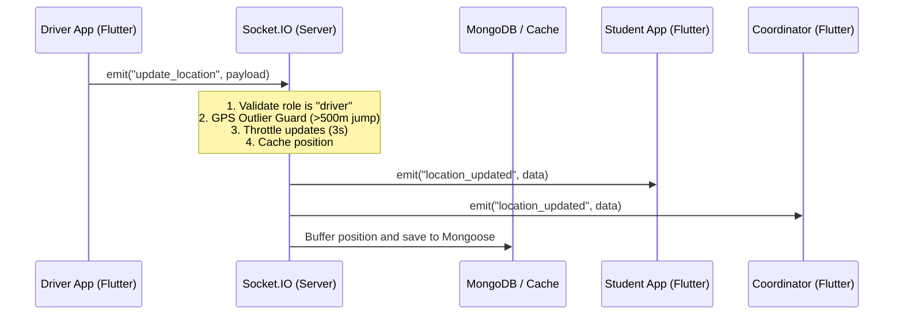

# Codebase Analysis: Mobile & Server Folders

This document provides a detailed breakdown of the mobile and server architectures, data contracts, and recommended next steps for development.

---

## 1. Project Directory Structure

```
bus-tracking-mobile-app/
├── mobile/                        # Flutter Mobile Application
│   ├── lib/
│   │   ├── core/                  # Shared services, utilities, routing, and providers
│   │   │   ├── constants/         # App constants, styling
│   │   │   ├── providers/         # Riverpod providers (socket, repositories, etc.)
│   │   │   └── services/          # SocketService, DataService, Map caching, voice recording
│   │   ├── features/              # Feature-oriented domain modules (auth, bus, driver, student, etc.)
│   │   └── shared/                # Globally reused UI views and widgets
│   └── pubspec.yaml               # Dart dependencies (Google Maps, Riverpod, Socket.io client, etc.)
│
└── server/                        # Node.js + TypeScript Backend
    ├── src/
    │   ├── config/                # DB connection, Redis connection, Environment variables
    │   ├── controllers/           # API Request Controllers (auth, transport, features)
    │   ├── models/                # Mongoose Database Models (User, Bus, Route, SOS, etc.)
    │   ├── routes/                # Express API Route mappings
    │   ├── services/              # Core business logic (MetricsService, etc.)
    │   ├── socket/                # Socket.IO connection and handlers (location, tracking, SOS, etc.)
    │   └── app.ts / index.ts      # Server configuration and entry points
    └── package.json               # Backend dependencies (Express, Socket.io, Mongoose, etc.)
```

---

## 2. Core Real-Time Architecture & Data Flows

The app relies heavily on **Socket.IO** for live interactions (e.g., GPS telemetry, SOS events, list notifications) and **Express REST endpoints** for static configurations and fallbacks.

### A. Bus Location Telemetry Pipeline


### B. Proximity & Stop Arrival Warnings
* **Nearby Stop Proximity**: Triggered automatically on the server when a driver's GPS location matches a student's preferred stop within a threshold.
* **Stop Reached Notification**: Driver app emits `stop_reached` when it's within 50m of a `RoutePoint`. The server broadcasts it transiently to the college room (`socket.to(collegeId).emit("stop_reached", ...)`), prompting active students to see a real-time banner.

---

## 3. Key Findings & Codebase Observations

### Mobile (Flutter)
* **State Management**: Built on Riverpod (`AsyncNotifier`, `StreamProvider`). Key optimization implementations include:
  * [studentLiveBusIdsProvider](file:///d:/Data/GitHub/bus-tracking-mobile-app/mobile/lib/features/bus/application/bus_provider.dart#L342-L347): Memoizes active bus IDs. This prevents downstream map widgets from rebuilding on every minor coordinate shift unless a bus joins or leaves the active tracking session.
  * [socketServiceProvider](file:///d:/Data/GitHub/bus-tracking-mobile-app/mobile/lib/core/providers/socket_provider.dart): Properly updates auth credentials and handles reconnection streams.
* **Navigation**: Powered by GoRouter for clean, route-guarded client redirects.

### Server (TypeScript)
* **Outlier Guard & Throttling**: Implemented inside [socket/handlers/location.ts](file:///d:/Data/GitHub/bus-tracking-mobile-app/server/src/socket/handlers/location.ts). It enforces a 3-second throttle window and verifies updates do not exceed a speed/distance outlier jump (>500m), neutralizing cold-start GPS jitter.
* **Security & Performance Middleware**: Standardized rate limits (100 req/min for general API, rate-limiter-flexible on socket events), Helmet headers, parameter pollution protection, and Mongoose database indexing on key lookup filters.
